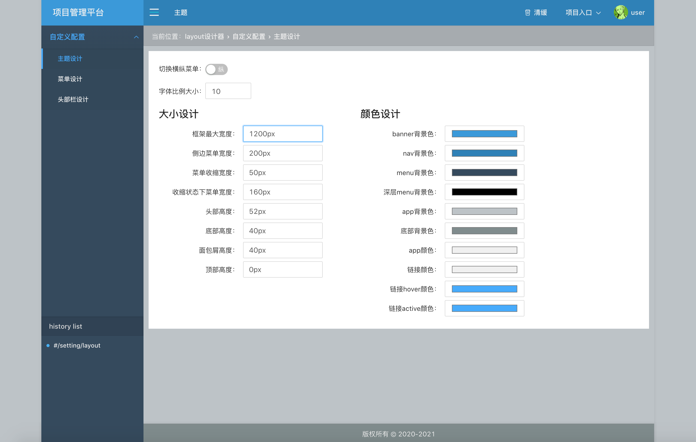
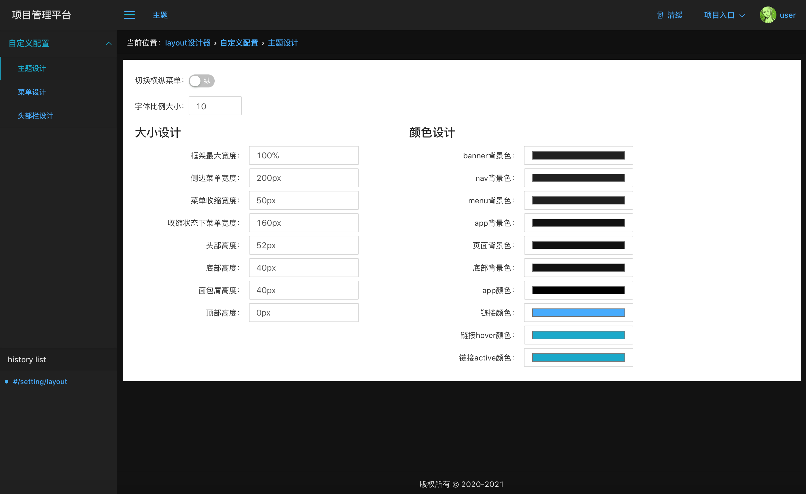

## layout设计器

上次讲到了 [自定义主题](./layout.md) ，现在我们以可视化界面来设计layout。

主要设计layout的布局和颜色，如横纵菜单、菜单宽度、头部高度，菜单颜色、导航栏颜色，字体大小及颜色等等。

动态配置menu菜单数据，头部左侧展示信息及右侧展示信息等。



### 主题设计

#### 骨架屏设计

[骨架屏](./骨架屏.md)



#### 大小设计


```
const dark=[
  {
    key:'--maxWidth',
    label:'框架最大宽度',
    value:'100%',
    type:'text',
  },
  {
    key:'--menuWidth',
    label:'侧边菜单宽度',
    value:'200px',
    type:'text',
  },
  {
    key:'--collapseWidth',
    label:'菜单收缩宽度',
    value:'50px',
    type:'text',
  },
  {
    key:'--collapseMenuWidth',
    label:'收缩状态下菜单宽度',
    value:'160px',
    type:'text',
  },
  {
    key:'--headerHeight',
    label:'头部高度',
    value:'52px',
    type:'text',
  },
  {
    key:'--footerHeight',
    label:'底部高度',
    value:'40px',
    type:'text',
  },
  {
    key:'--breadHeight',
    label:'面包屑高度',
    value:'40px',
    type:'text',
  },
  {
    key:'--topbarHeight',
    label:'顶部高度',
    value:'0px',
    type:'text',
  },
];

```

#### 颜色设计


```
const dark=[
  {
    key:'--bannerBgColor',
    label:'banner背景色',
    value:'#212121',
    type:'color',
  },
  {
    key:'--navBgColor',
    label:'nav背景色',
    value:'#212121',
    type:'color',
  },
  {
    key:'--menuBgColor',
    label:'menu背景色',
    value:'#212121',
    type:'color',
  },
  {
    key:'--deepMenuBgColor',
    label:'深层menu背景色',
    value:'hsla(0,0%,0%,.03)',
    type:'color',
  },
  {
    key:'--appBgColor',
    label:'app背景色',
    value:'#121212',
    type:'color',
  },
  {
    key:'--footerBgColor',
    label:'底部背景色',
    value:'#121212',
    type:'color',
  },
  {
    key:'--appColor',
    label:'app颜色',
    value:'rgba(255,255,255,.87)',
    type:'color',
  },
  {
    key:'--linkColor',
    label:'链接颜色',
    value:'#40a9ff',
    type:'color',
  },
  {
    key:'--linkHoverColor',
    label:'链接hover颜色',
    value:'#00a8cc',
    type:'color',
  },
  {
    key:'--linkActiveColor',
    label:'链接active颜色',
    value:'#00a8cc',
    type:'color',
  },
];

```
#### 字体大小设计

```
const changeFontSize=useDebounce(value=>document.documentElement.style.setProperty('--rootSize',value),delay);

```

#### 横纵菜单切换


```
const switch=type=>store.setState({'set-menuType':{menuType:type}});

```

### 菜单配置

### 头部栏配置

#### 左侧导航栏

#### 右侧导航栏