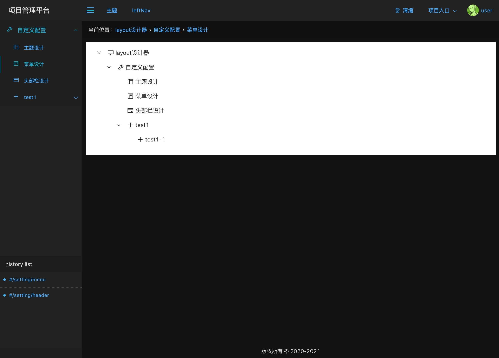
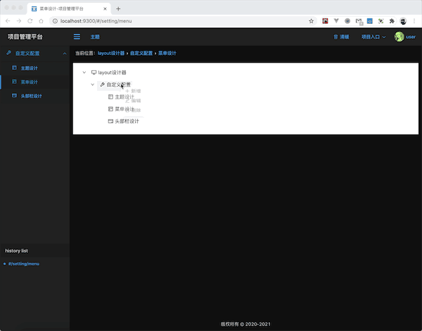
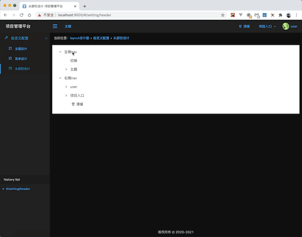

## 菜单栏配置



### 菜单属性

- url：路径
- name：展示名
- icon：图表
- redirect：重定向
- children：子菜单
- component：页面
- denied：权限控制
- hideMenu：菜单隐藏展示
- errorBoundary：错误边界。默认有错误边界处理，可自定义。
- resolve：数据请求并缓存，可用store.getState(key)获取，store.setState(state)更新。
- loadData:数据请求，不缓存数据。

### 新增、编辑、删除菜单



```
const updateRouter=useCallback(menu=>{
  store.setState({'update-router':{menu}});
},[]);

const addFn=item=>{
  setVisible(true);
  setModalType('add');
  setItem(item);
};
const editFn=item=>{
  setVisible(true);
  setModalType('edit');
  setItem(item);
};
const deleteFn=item=>{
  confirm({
    title: '确定删除此菜单吗？',
    icon: <ExclamationCircleOutlined />,
    content: `name: ${item.name}, path: ${item.path}`,
    okText: '删除',
    okType: 'danger',
    cancelText: '取消',
    onOk() {
      const newMenu=selectedHandle((data,i)=>data.splice(i,1))(menu,item.path,'path');
      updateRouter(newMenu);
    },
    onCancel() {
      console.log('Cancel');
    },
  });
};

useEffect(()=>{
  const {subscribe}=store;
  subscribe('update-router',result=>{
    updateRouter({routers:result.menu});
  });
},[]);

```

## 头部栏配置




```
// setNav

useEffect(()=>{
  const {subscribe}=store;
  subscribe('nav-data',result=>{
    const {leftList,rightList}=result;
    if(leftList){
      setLeftList(leftList);
    }
    if(rightList){
      setRightList(rightList);
    }
  });
},[]);

const updateNav=useCallback((type,data)=>{
  store.setState({'update-nav':{type,data}});
},[]);

// updateNav

useEffect(()=>{
  const {subscribe,setState}=store||{};
  if(subscribe){
    subscribe('update-nav',result=>{
      const {type,data}=result;
      if(type==='left'){
        setLeftList(data);
        setState({'nav-data':{leftList:data}});
      }
      if(type==='right'){
        setRightList(data);
        setState({'nav-data':{rightList:data}});
      }
    });
    setState({'nav-data':{leftList,rightList}});
  }
},[]);

```

