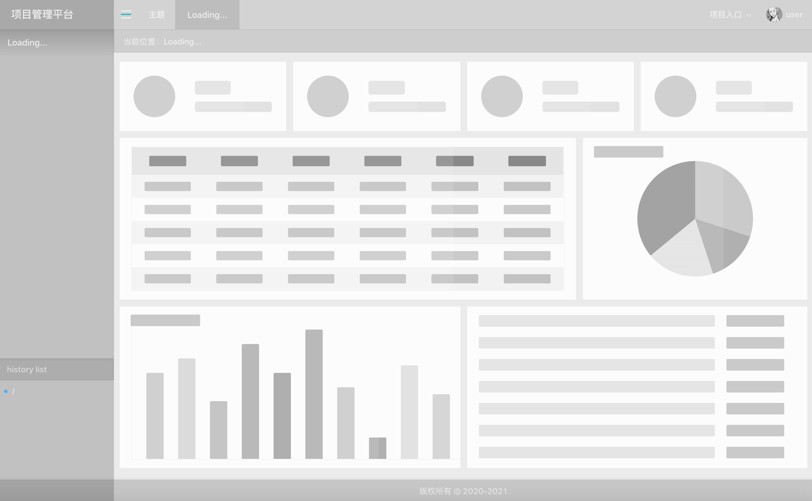
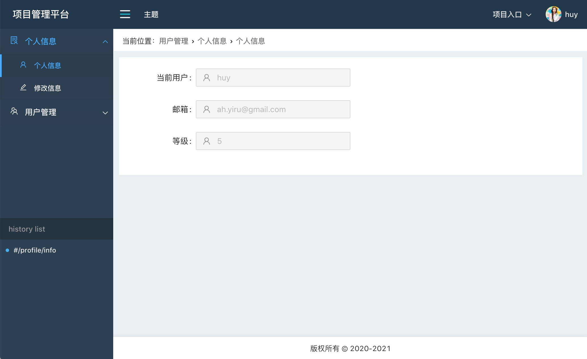

## 骨架屏





### layout

进入系统时，我们会加载文件或请求数据，这时我们可以使用骨架屏来展示，避免出现空白页面或闪烁带来的不良体验。

前面讲了 [自定义layout](./layout.md) ，我们可以根据自身需求设计出各种各样的layout，现在我们可以设计出骨架layout的样式。

```
const skeleton=[
  {
    key:'--bannerBgColor',
    label:'banner背景色',
    value:'hsla(0,0%,0%,.2)',
    type:'color',
  },
  {
    key:'--navBgColor',
    label:'nav背景色',
    value:'hsla(0,0%,0%,.1)',
    type:'color',
  },
  {
    key:'--menuBgColor',
    label:'menu背景色',
    value:'hsla(0,0%,0%,.18)',
    type:'color',
  },
  {
    key:'--deepMenuBgColor',
    label:'深层menu背景色',
    value:'hsla(0,0%,0%,.015)',
    type:'color',
  },
  {
    key:'--appBgColor',
    label:'app背景色',
    value:'hsla(0,0%,0%,.08)',
    type:'color',
  },
  {
    key:'--footerBgColor',
    label:'底部背景色',
    value:'hsla(0,0%,0%,.15)',
    type:'color',
  },
  {
    key:'--appColor',
    label:'app颜色',
    value:'#f0f0f0',
    type:'color',
  },
  {
    key:'--linkColor',
    label:'链接颜色',
    value:'#f0f0f0',
    type:'color',
  },
  {
    key:'--linkHoverColor',
    label:'链接hover颜色',
    value:'#40a9ff',
    type:'color',
  },
  {
    key:'--linkActiveColor',
    label:'链接active颜色',
    value:'#40a9ff',
    type:'color',
  },
];

```

这个非常简单，配置一下即可。

接下来我们可以设计主页的 skeleton。

### dashboard

一般的管理平台，多以图表、表格、card等展示为主，所以可以简单设计为：

1. card
2. charts
3. table
4. list

根据设计用css画出对应的skeleton展示区域。

最后可为skeleton添加家在状态的波浪动效。对应的样式可见代码类 `sk-card sk-list sk-table sk-piechart sk-barchart`。

加载动效样式如下：

```
.loading-wave{
  position:relative;
  &::after{
    content:'';
    position:absolute;
    display:block;
    top:0;
    left:0;
    height:100%;
    width:100%;
    background-color:rgba(255,255,255,.9);
    border-radius:2px;
    opacity:0;
    animation:wave 2s ease-out infinite;
  }
  @keyframes wave{
    0%{
      width:0;
      opacity:.1;
    }
    34%{
      width:0;
      opacity:.5;
    }
    100%{
      width:100%;
      opacity:0;
    }
  }
}

```
这样，我们自定义的骨架屏就出来了。


