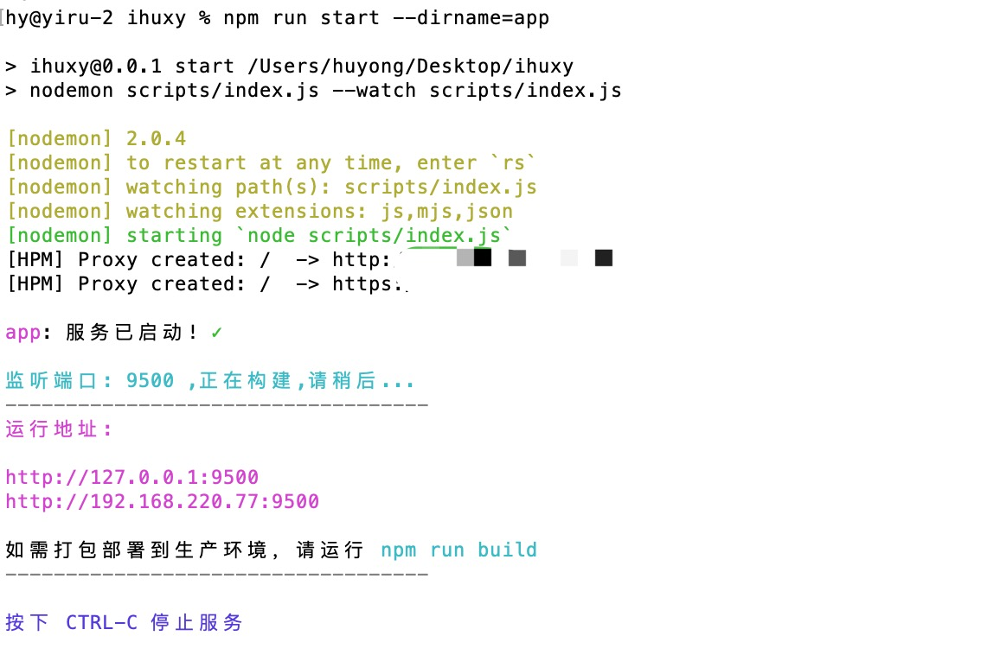

## 前端工程化-工程配置

> 工欲善其事，必先利其器。

之前讨论过 [前端工程化](../explore/前端探索之工程化.md)，工程化可以 ***提高应用体验，提高开发效率，降低开发门槛，降低维护成本*** 等优点，今天我们来讲一下开发中的配置文件，我们可以通过修改配置文件，来满足不同需求的快速开发。

### webpack

#### babel.config配置

```
const config=api=>{
  api.cache.using(() => process.env.NODE_ENV === 'development');
  const presets=[
    '@babel/preset-env',
    '@babel/preset-react',
  ];

  const plugins=[
    '@babel/plugin-syntax-dynamic-import',
    '@babel/plugin-proposal-optional-chaining',
    '@babel/plugin-proposal-nullish-coalescing-operator',
    '@babel/plugin-transform-runtime',
  ];

  const env={
    development: {
      plugins: [],
    },
    production: {
      plugins: [],
    },
    test: {
      plugins: [
        '@babel/plugin-transform-modules-commonjs',
      ],
    },
  };

  return {
    presets,
    plugins,
    env,
  };
};

```

#### eslint代码规范

```
module.exports={
  root: true,
  env:{
    browser: true,
    commonjs: true,
    node: true,
    es6: true,
    jest: true,
  },
  extends: 'eslint:recommended',
  parser: 'babel-eslint',
  rules: {
    'react-hooks/rules-of-hooks': 2,
    'react-hooks/exhaustive-deps': 1,
    'prettier/prettier': 'error',
  },
  plugins: [
    'babel',
    'react',
    'react-hooks',
  ],
};

```

#### jest单元测试

```
module.exports={
  verbose:true,
  coverageThreshold:{
    global:{
      branches:30,
      functions:30,
      lines:30,
      statements:30,
    },
  },
  coveragePathIgnorePatterns:['/node_modules/'],
  testRegex:'(/__tests__/.*\\.(test|spec))\\.(tsx?|jsx?)$',
  testPathIgnorePatterns:['/scripts/','configs','common'],
  moduleFileExtensions:['js','jsx','ts','tsx','mjs','json','node'],
  modulePathIgnorePatterns:['/node_modules/'],
  moduleNameMapper:{
    '\\.(jpg|jpeg|png|gif|eot|otf|webp|svg|ttf|woff|woff2|mp4|webm|wav|mp3|m4a|aac|oga)$':'<rootDir>/__mocks__/fileMock.js',
    '\\.(css|less)$':'<rootDir>/__mocks__/styleMock.js',
  },
  transform:{
    '^.+\\.tsx?$':'ts-jest',
    '^.+\\.jsx?$':'babel-jest',
  },
  transformIgnorePatterns:['/node_modules/'],
  unmockedModulePathPatterns:['<rootDir>/node_modules/react/','<rootDir>/node_modules/react-dom/'],
  collectCoverage: true,
};

```

#### husky代码提交钩

```
module.exports={
  hooks:{
    'pre-commit':'npm run lint && npm run test',
    // 'pre-push':'npm run test',
    'commit-msg':'commitlint -E HUSKY_GIT_PARAMS',
  },
};

```

### nodejs

#### nodejs服务

```
app.listen(app.get('port'),err=>{
  if(err){
    console.log(err);
    return false;
  }
  console.log('\n服务已启动! '.black+'✓'.green);
});

```

#### 配置文件

```
const app={
  HOST:process.env.IP||'localhost',
  PORT:process.env.PORT||9500,
  PRO_PORT:process.env.PRO_PORT||9501,
  BUILD_DIR:'../dist',
  DIST:'../dist',
  PUBLIC_DIR:'../public',
  DEV_ROOT_DIR:'',
  PRD_ROOT_DIR:'/dev-base',
  DEFAULT_TOKEN:'Basic 123456',
  PROXY_URI:'http://47.105.94.51:9202',
  SALT:'123',
  TOKEN_SECRET:'123',
  mongoUrl:'mongodb://localhost:27017/test',
  serverUrl:'http://localhost:9500',
};

```

#### 代理设置

```
const proxyCfg=url=>({
  prefix:'/v1',
  opts:{
    target: url,
    changeOrigin: true,
    // pathRewrite: {'^/v1':'/v1'},
  },
});

```

#### 启动服务

```
// 获取配置信息
const configs=require('../configs');
const appName=require('../configs/appName')||'app';
const {HOST,PORT,PROXY_URI}=configs(appName);

// 获取代理配置
const proxyCfg=require('./proxyCfg');

// 启动代理
const {prefix,opts}=proxyCfg(PROXY_URI);
app.use(prefix,createProxyMiddleware(opts));

// 启动webpack
const devMiddleware=webpackDevMiddleware(compiler,{
  contentBase:webpackConfig.output.path,
  publicPath:webpackConfig.output.publicPath,
  hot:true,
  inline:true,
});
app.use(webpackHotMiddleware(compiler));
app.use(devMiddleware);

// 设置host、port
app.set('host', HOST);
app.set('port', PORT);

app.use(cors());
app.use(logger('dev'));
app.use(bodyParser.json({limit:'20mb'}));
app.use(bodyParser.urlencoded({limit:'20mb',extended:true}));
app.use(compression());
if(app.get('env')==='production'){
  app.use(function(req,res,next) {
    const protocol=req.get('x-forwarded-proto');
    protocol==='https'?next():res.redirect('https://'+req.hostname+req.url);
  });
}

// browserRouter
app.get('*',(req,res)=>{
  const htmlBuffer=devMiddleware.fileSystem.readFileSync(`${webpackConfig.output.path}/index.html`);
  res.send(htmlBuffer.toString());
});

```

### 框架配置

#### [路由及全局配置](../router/useRouter.md)

```
const browserRouter=!process.env.isDev;

const configs=require('../../configs');
const appName=require('../../configs/appName')||'app';
const {DEV_ROOT_DIR,PRD_ROOT_DIR}=configs(appName);

const basepath=browserRouter?PRD_ROOT_DIR:DEV_ROOT_DIR;

export const title='项目管理平台';

const beforeRender=input=>{
  const token=storage.get('token');
  if(!token){
    const {path}=input;
    if(path.includes('/operation')){
      return {path:'/operation/user/login'};
    }
    return {path:'/user/signin'};
  }
};

export default {
  browserRouter,
  title,
  beforeRender,
  basepath,
  // afterRender,
  {...otherConfigs},
};

```

### package.json配置

#### 命令工具

```
"scripts": {
  "start": "nodemon scripts/index.js --watch scripts/index.js",
  "build": "webpack --config scripts/webpack.production.js --progress",
  "analyze": "ANALYZE=1 webpack --config scripts/webpack.production.js --progress",
  "server": "nodemon scripts/server.js --watch scripts/server.js",
  "test": "jest --colors --coverage",
  "eslint": "eslint app/**/*.{js,jsx}",
  "stylelint": "stylelint app/**/*.{css,less}",
  "lint": "npm run eslint && npm run stylelint",
  "lint-fix": "eslint --fix app/**/*.{js,jsx}"
},

```

可以根据命令行运行不同项目，如：

 ```
 npm run start --dirname=project1
 ```
这时就会运行project1项目。




