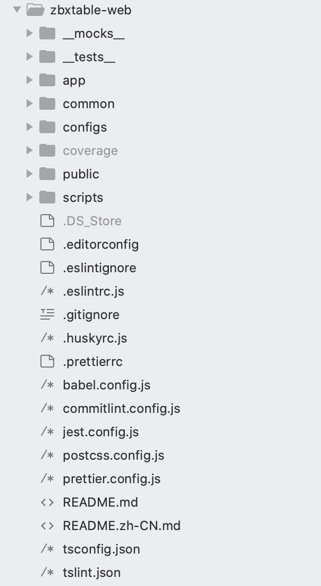

## ZbxTable-Web

[ZbxTable](https://zbxtable.cactifans.com/) 是一个开源的 Zabbix 报表系统。

基本功能如下：

- 导出监控指标特定时间段内的详情数据与趋势数据到 xlsx
- 导出特定时间段内 Zabbix 的告警消息到 xlsx
- 对特定时间段研内的告警消息进行分析，告警 Top10 等
- 按照主机组导出巡检报告
- 对 Zabbix 图形按照数类型进行显示和查看并支持导出到 pdf
- 主机未恢复告警显示和查询

### ZbxTable-web介绍

该平台是基于react开发，使用webpack5构建，集成了eslint代码规范、jest单元测试、husky、服务端运行、代理配置等。包含了用户登录、自定义layout、自定义主题、权限路由、i18n等。使用了useRouter、useAsync，自定义fetch、简易状态管理等。

[项目地址](https://github.com/canghai908/zbxtable-web)

代码目录如下

### 工程配置

配置文件主要在configs和scripts目录里面，我们可以通过修改配置文件，来满足不同需求的快速开发。

详情请查看 [工程配置](https://github.com/ihuxy/doc/blob/master/nodejs/%E5%89%8D%E7%AB%AF%E5%B7%A5%E7%A8%8B%E5%8C%96%E5%B7%A5%E7%A8%8B%E9%85%8D%E7%BD%AE.md)

### 路由配置

useRouter是基于popstate和hashchange来监听路由变化，支持history.pushState、history.replaceState来切换路由，并提供了一些常用工具，如：store（状态管理）、eventBus（订阅发布）等。

[useRouter使用](https://github.com/ihuxy/doc/blob/master/router/useRouter%E4%BD%BF%E7%94%A8.md)

### layout设计器

主要设计layout的布局和颜色，如横纵菜单、菜单宽度、头部高度，菜单颜色、导航栏颜色，字体大小及颜色等等。

动态配置menu菜单数据，头部左侧展示信息及右侧展示信息等。

[layout设计器](https://github.com/ihuxy/doc/blob/master/layout/layout%E8%AE%BE%E8%AE%A1%E5%99%A8.md)

### 权限路由和i18n配置

#### 权限路由

根据服务端返回的权限key，来判断本地路由是否有访问权限，然后根据权限渲染页面。

#### i18n

将语言信息（zh、en...）存入storage，然后根据language获取系统语言库，将语言库存入store，以供页面使用。

[权限路由和i18n配置](https://github.com/ihuxy/doc/blob/master/modules/%E6%9D%83%E9%99%90%E8%B7%AF%E7%94%B1%E3%80%81%E8%B7%AF%E7%94%B1%E8%BF%87%E6%B8%A1%E6%95%88%E6%9E%9C%E5%92%8Ci18n%E9%85%8D%E7%BD%AE.md)

### JS工具库-utils

[utils](https://github.com/ihuxy/doc/blob/master/utils/utils.md)

### 常用Hooks

[use](https://github.com/ihuxy/doc/blob/master/use/use.md)

通过这些通用工具，我们可以设计开发各种适合需求的项目。详情可查看项目模版 [https://github.com/ihuxy/demo1](https://github.com/ihuxy/demo1)

