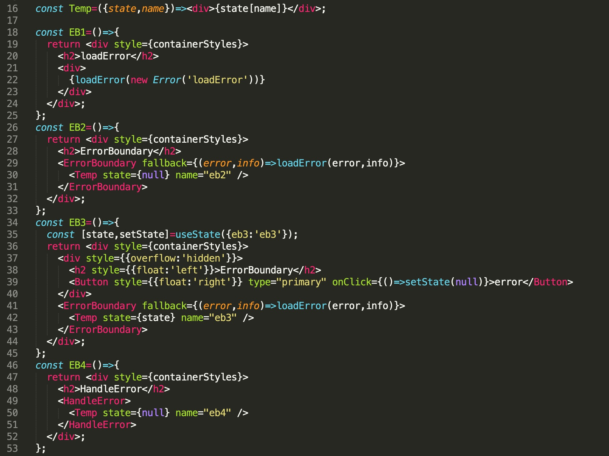

## React Suspense & ErrorBoundary


### Suspense

> Suspense 让组件“等待”某个异步操作，直到该异步操作结束即可渲染。

Suspense 不是一个数据请求的库，而是一个机制。这个机制是用来给数据请求库向 React 通信说明某个组件正在读取的数据当前仍不可用。通信之后，React 可以继续等待数据的返回并更新 UI。

```javascript
const Index=props=>{
  return <div>
    <Row gutter={[12,12]}>
      <Col span={12}>
        <Suspense fallback={<Spinner />}>
          <UserInfo userinfo={sus1} title="sus-test1" />
        </Suspense>
      </Col>
      <Col span={12}>
        <Suspense fallback={<Spinner />}>
          <Allusers users={sus2} title="sus-test2" />
        </Suspense>
      </Col>
    </Row>
    <Row gutter={[12,12]}>
      <Col span={12}>
        <Suspense fallback={<Spinner />}>
          <UserInfo userinfo={userinfo} />
        </Suspense>
      </Col>
      <Col span={12}>
        <Suspense fallback={<Spinner />}>
          <Allusers users={users} />
        </Suspense>
      </Col>
    </Row>
  </div>;
};

```

尽早开始获取数据，在渲染之前就进行数据获取。

```javascript
const UserInfo=({userinfo,title})=>{
  const {result}=userinfo.read();
  const info=Object.keys(result).map(v=>({key:v,value:result[v]}));
  return <div style={containerStyles}>
    <h2>{title||'个人信息'}</h2>
    {
      info.map(({key,value})=><div><span>{key}：</span><span>{value}</span></div>)
    }
  </div>;
};
const Allusers=({users,title})=>{
  const {result}=users.read();
  return <div style={containerStyles}>
    <h2>{title||'用户信息'}</h2>
    <Table dataSource={result} columns={columns} />
  </div>;
};

```


[useRouter](../router/useRouter.md) 里面的`loadData`和`resolve `也是在渲染之前就开始进行数据获取了，它们和`suspense`的区别是：`loadData`和`resolve `是通过setState来更新界面的，而`suspense`是通过调用`read`函数，`catch`异步状态来选择渲染内容的。

`useRouter`实现的异步渲染：

router.jsx

```javascript
{
  path:'/suspense',
  name:'suspense',
  icon:<LayoutOutlined />,
  loadData:{
    userinfo:findFn,
    users:findAllFn,
  },
  component:()=>import('../app/tools/suspense'),
}

```
suspense/index.jsx

```javascript
const Index=props=>{
  let {userinfo,users}=props;
  userinfo=userinfo?.result;
  users=userinfo?.users;
  return <div>
    <Row gutter={[12,12]}>
      <Col span={12}>
        {userinfo?<UserInfo userinfo={userinfo} />:<Spinner />}
      </Col>
      <Col span={12}>
        {users?<UserInfo users={users} />:<Spinner />}
      </Col>
    </Row>
  </div>;
};

```

效果和使用`suspense`是一样的。


### ErrorBoundary


> 错误边界是一种 React 组件，这种组件可以捕获并打印发生在其子组件树任何位置的 JavaScript 错误，并且，它会渲染出备用 UI，而不是渲染那些崩溃了的子组件树。错误边界在渲染期间、生命周期方法和整个组件树的构造函数中捕获错误。


错误边界的粒度由你来决定，可以将其包装在最顶层的路由组件并为用户展示一个 “Something went wrong” 的错误信息，就像服务端框架经常处理崩溃一样。你也可以将单独的部件包装在错误边界以保护应用其他部分不崩溃。

[useRouter](../router/useRouter.md) 默认就为路由加上了`ErrorBoundary`，展示当前错信息，当然你也可以自定义展示界面。

```javascript
import React from 'react';

export default class ErrorBoundary extends React.Component{
  state={
    error:null,
  };
  static getDerivedStateFromError(error){
    return {error};
  }
  render(){
    const {error}=this.state;
    const {fallback,children}=this.props;
    if(error){
      return fallback(error);
    }
    return children;
  }
}

```


#### loadError

自定义错误展示内容。

```javascript
loadError(new Error('loadError'))

```

#### ErrorBoundary

fallback为出错时展示的内容。

```javascript
<ErrorBoundary fallback={(error,info)=>loadError(error,info)}>
  <Comp />
</ErrorBoundary>

```

#### HandleError

```javascript
<HandleError>
  <Comps />
</HandleError>

```


