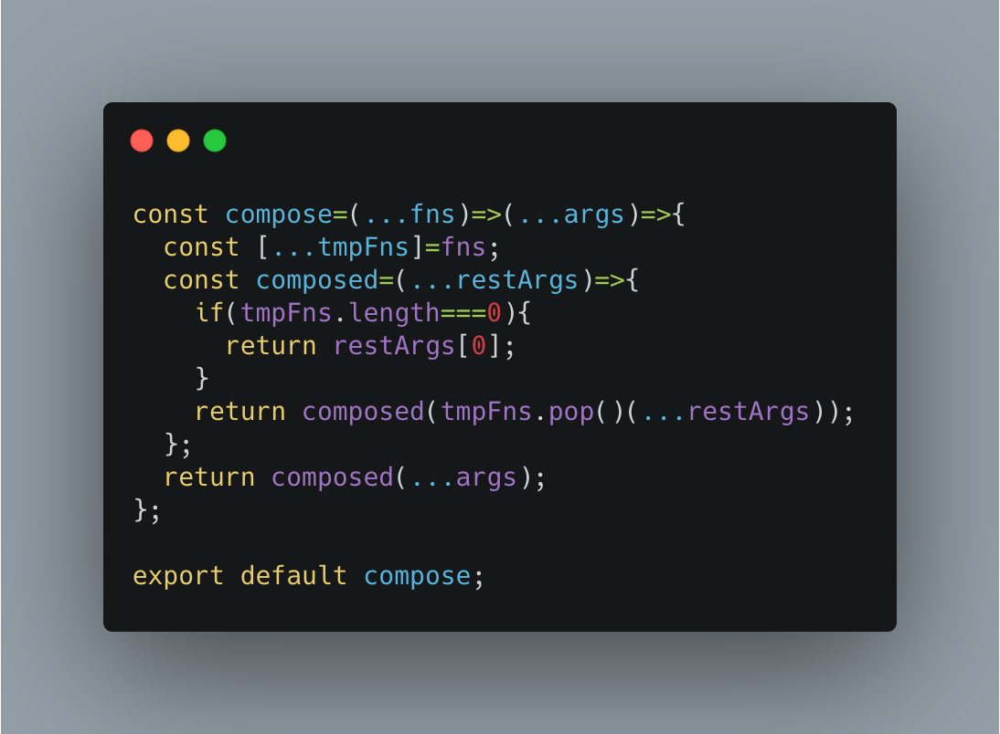

## 工具库-utils



### curry

```
const curry=(fn,arity=fn.length)=>{
  const curried=(...args)=>args.length>=arity?fn(...args):(...restArgs)=>curried(...args,...restArgs);
  return curried;
};

```

### compose

[compose](./compose.md)

```
const compose=(...fns)=>(...args)=>{
  const [...tmpFns]=fns;
  const composed=(...restArgs)=>{
    if(tmpFns.length===0){
      return restArgs[0];
    }
    return composed(tmpFns.pop()(...restArgs));
  };
  return composed(...args);
};

```

### clone

```
const clone=obj=>{
  if(!isArray(obj)&&!isObject(obj)){
    return obj;
  }
  const newobj=isArray(obj)?[]:{};
  for(let i in obj){
    const item=obj[i];
    newobj[i]=(isReactEle(item)||typeof item!=='object')?item:item!==obj?clone(item):'cyclic';
  }
  return newobj;
};

```

### isEqual

```
const isEqual=(a,b)=>{
  const typeA=getType(a);
  const typeB=getType(b);
  if(typeA!==typeB){
    return false;
  }
  if(a==null||b==null){
    return a===b;
  }
  if(['object','array'].indexOf(typeA)===-1){
    return a.toString()===b.toString();
  }
  if(Object.keys(a).length!==Object.keys(b).length){
    return false;
  }
  if(isCyclic(a)&&isCyclic(b)){
    return isEqual(a,b);
  }
  for(let k in b){
    if(hasProp(a,k)!==hasProp(b,k)){
      return false;
    }
    if(!isEqual(a[k],b[k])){
      return false;
    }
  }
  return true;
};

```

### getType

```
const getType=value=>Object.prototype.toString.call(value).slice(8,-1).toLowerCase();

```

### filter

```
const filter=(list,keyword,fields=[],exact=false)=>{
  if(!isValidArr(list)){
    return [];
  }
  if(!keyword){
    return list;
  }
  if(typeof fields==='string'){
    fields=[fields];
  }
  return list.filter(v=>{
    fields=fields.length>0?fields:Object.keys(v);
    const matched=fields.filter(field=>{
      const fieldValue=v[field];
      if(fieldValue==null){
        return false;
      }
      if(exact){
        return fieldValue===keyword;
      }
      const reg=new RegExp(keyword,'gi');
      const match=fieldValue.toString().match(reg);
      return match;
    });
    return matched.length;
  });
};

```

### pick

```
const pick=(obj,arrKeys)=>{
  if(obj==null||typeof obj!=='object'){
    return {};
  }
  if(typeof arrKeys==='string'){
    arrKeys=[arrKeys];
  }
  if(!isArray(arrKeys)){
    return obj;
  }
  const newObj={};
  arrKeys.map(key=>{
    if(key in obj){
      newObj[key]=obj[key];
    }
  });
  return newObj;
};

```

### sort

```
const sort=(arr,key=null,desc=false)=>{
  return arr.sort((x,y)=>{
    const a=key?x[key]:x;
    const b=key?y[key]:y;
    if(!isNaN(Number(a))&&!isNaN(Number(a))){
      return desc?b-a:a-b;
    }
    if(typeof a==='string'&&typeof b==='string'){
      return desc?b.localeCompare(a):a.localeCompare(b);
    }
    if(typeof a==='string'&&typeof b==='number'){
      return desc?-1:1;
    }
    if(typeof a==='number'||typeof a==='string'){
      return desc?1:-1;
    }
    return desc?-1:1;
  });
};

```

### unique

```
const unique=(arr,key='id')=>{
  if(!isValidArr(arr)){
    return arr;
  }
  const newArr=[];
  const keys=[];
  arr.map(v=>{
    const cKey=v[key]??v;
    if(!keys.includes(cKey)){
      keys.push(cKey);
      newArr.push(v);
    }
  });
  return newArr;
};

```

### traverItem

```
const traverItem=fn=>(arr,childKey='children')=>{
  if(!isArray(arr)){
    return arr;
  }
  const copyArr=clone(arr);
  const traver=(data,parent=[])=>{
    data.map((v,k)=>{
      v=fn(v,parent,k)||v;
      if(isArray(v[childKey])){
        const {[childKey]:children,...rest}=v;
        traver(children,[...parent,{...rest,'@@index':k}]);
      }
    });
  };
  traver(copyArr);
  return copyArr;
};

```

### flatten

```
const flatten=(data,childKey='children')=>{
  const newArr=[];
  traverItem(item=>{
    const {[childKey]:children,...rest}=item;
    newArr.push(rest);
  })(data,childKey);
  return newArr;
};

```

### getValue

```
const keyArr=keys=>keys.replace(/\[['"]?(.*?)['"]?\]/g,'.$1').split('.');
const getValue=(object,keys)=>{
  keys=keyArr(keys);
  const checkValue=(obj,key)=>{
    if(!key[0]){
      return obj;
    }
    if(typeof obj[key[0]]==='object'){
      return checkValue(obj[key[0]],key.slice(1));
    }
    if(key.length>1){
      return undefined;
    }
    return obj[key[0]];
  };
  return checkValue(object,keys);
};


```

### sleep

```
const sleep=(ms=350)=>new Promise(resolve=>setTimeout(resolve,ms));

```

### memoize

```
const memoize=(fn,len=100)=>{
  let cache=[];
  return (...args)=>{
    const key=JSON.stringify(args);
    const cached=cache.find(v=>v.key===key);
    if(!cached){
      const result=fn(...args);
      cache.push({key,result});
      if(cache.length>len){
        cache.shift();
      }
      return result;
    }
    return cached.result;
  };
};

```

### storage

```
const storage={
  get:(name)=>{
    let data=null;
    try{
      data=JSON.parse(localStorage.getItem(name));
    }catch(err){
      data=localStorage.getItem(name);
    }
    return data;
  },
  set:(name,data)=>{
    if(typeof data==='object'){
      data=JSON.stringify(data);
    }
    localStorage.setItem(name,data);
  },
  rm:(name)=>{
    localStorage.removeItem(name);
  },
  clear:()=>{
    localStorage.clear();
  },
};

```

### session

```
const session={
  get:(name)=>{
    let data=null;
    try{
      data=JSON.parse(sessionStorage.getItem(name));
    }catch(err){
      data=sessionStorage.getItem(name);
    }
    return data;
  },
  set:(name,data)=>{
    if(typeof data==='object'){
      data=JSON.stringify(data);
    }
    sessionStorage.setItem(name,data);
  },
  rm:(name)=>{
    sessionStorage.removeItem(name);
  },
  clear:()=>{
    sessionStorage.clear();
  },
};

```

### debounce

```
const debounce=(func,wait=60)=>{
  let timer=null;
  return function (...args){
    clearTimeout(timer);
    timer=setTimeout(()=>func.apply(this,args),wait);
  };
};

```

### throttle

```
const throttle=(func,delay=60)=>{
  let timer=null,start=0;
  return function (...args){
    const current=+new Date();
    clearTimeout(timer);
    if(current-start>delay){
      func.apply(this,args);
      start=current;
    }else{
      timer=setTimeout(()=>func.apply(this,args),delay);
    }
  };
};

```

### fetch

[fetch](./fetcher.md)


### merge

```
const mergeObj=(base,extend)=>{
  if(!isObject(base)){
    return extend;
  }
  if(!isObject(extend)){
    return base;
  }
  const newObj=clone(base);
  for(let k in extend){
    if(isObject(newObj[k])&&isObject(extend[k])){
      newObj[k]=mergeObj(newObj[k],extend[k]);
    }else if(isArray(newObj[k])&&isArray(extend[k])){
      newObj[k]=mergeArr(newObj[k],extend[k]);
    }else{
      newObj[k]=extend[k];
    }
  }
  return newObj;
};

```