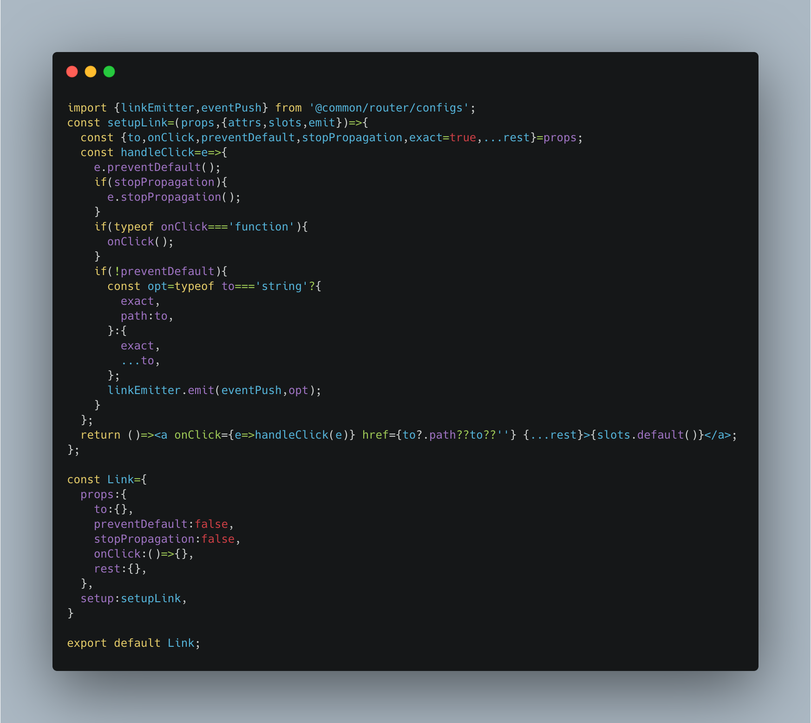
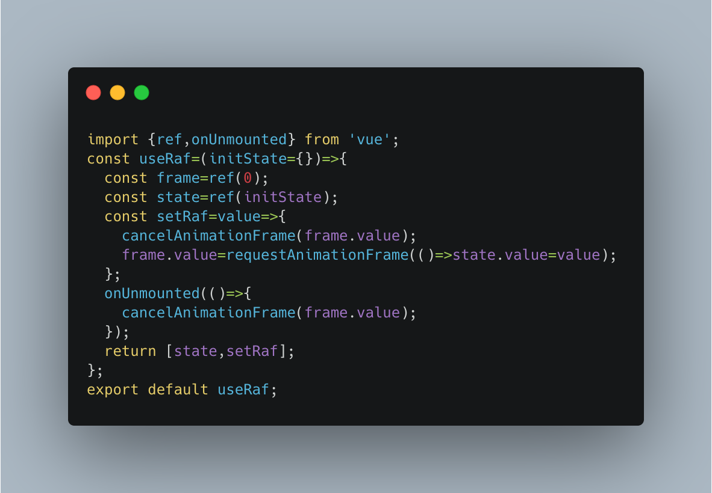
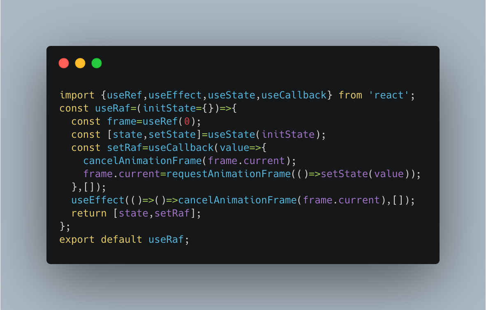

## 初探composition-api

### 介绍

> 以函数为载体，将业务相关的逻辑代码抽取到一起，整体打包对外提供相应能力，这就是 Composition API。

可以理解它是我们组织代码，解决逻辑复用的一种方案。

Composition API 带来了一种创建组件、分离代码和提取可复用代码段的全新方式。

使用 Compositon API 之后，当涉及到跨组件之间提取、复用逻辑时，就会非常的灵活。一个合成函数只依赖于它的参数和全局引入的 Vue APIs，而不是充满魔法的 this 上下文。我们只需要将组件中你想复用的那部分代码抽离，然后将它导出为函数就可以了。

如果项目足够复杂，Composition API 能够很好地把逻辑抽离出来，每个组件的 setup() 函数所返回的值都能够方便地被追踪。这样的能力在维护大型项目或者多人协作项目的时候会非常有用，通用的逻辑也可以更细粒度地共享出去。

这与react hooks很相似。

### 使用 [composition-api](https://composition-api.vuejs.org/zh/api.html)

大概看了一下 [composition-api](https://composition-api.vuejs.org/zh/api.html) ，感觉它和react hooks很像，于是将之前react写的一些hooks稍微修改（主要是useState、useEffect变为ref、reactive、watch等），也可以在vue中使用。有些展示组件是可以通用的，无需修改。如：

```js
import styles from './index.less';
const Spinner=({global})=><div className={global?`${styles.spinner} ${styles.global}`:styles.spinner}>
  <figure className={styles.spinning} />
</div>;
export default Spinner;

```

#### jsx

```js
npm i -D @vue/babel-plugin-jsx

const plugins=[
  ...,
  '@vue/babel-plugin-jsx'
];

```

#### API用法

##### setup

setup 函数是一个新的组件选项。作为在组件内使用 Composition API 的入口点。

```js
const MyComponent = {
  setup(props,{attrs,slots,emit}) {
    ...
  },
}

```
setup接收2个参数，第一个props，第二个是上下文对象context。

不要解构 props 对象，那样会使其失去响应性。context可以解构。

##### reactive

接收一个普通对象然后返回该普通对象的响应式代理

##### ref

接受一个参数值并返回一个响应式且可改变的 ref 对象。ref 对象拥有一个指向内部值的单一属性 .value

##### reactive VS ref

- ref：适合简单数据类型，浅转换为响应数据。reactive：适合复杂数据类型，深入转换响应数据。
- ref：定义及访问时需加上 `.value`，reactive则不需要。

##### watchEffect

立即执行传入的一个函数，并响应式追踪其依赖，并在其依赖变更时重新运行该函数。

###### 清除副作用

```js
watchEffect((onInvalidate) => {
  const token = performAsyncOperation(id.value);
  onInvalidate(() => {
    // id 改变时 或 停止侦听时
    // 取消之前的异步操作
    token.cancel();
  });
});

```
##### watch

watch 需要侦听特定的数据源，并在回调函数中执行副作用。

watch 和 watchEffect 在停止侦听, 清除副作用 (相应地 onInvalidate 会作为回调的第三个参数传入)，副作用刷新时机 和 侦听器调试 等方面行为一致。

```js
// 侦听一个 reactive
const state = reactive({ count: 0 })
watch(() => state.count,(count, prevCount) => {
  /* ... */
});
// 直接侦听一个 ref
const count = ref(0)
watch(count, (count, prevCount) => {
  /* ... */
});
// 侦听多个数据源
watch([fooRef, barRef], ([foo, bar], [prevFoo, prevBar]) => {
  /* ... */
});

```
#### 生命周期钩子函数

```js
const MyComponent = {
  setup() {
    onMounted(() => {
      console.log('mounted!')
    });
    onUpdated(() => {
      console.log('updated!')
    });
    onUnmounted(() => {
      console.log('unmounted!')
    });
  },
};

```

#### 对比react hooks

reactive和ref相当于useState，用于更新数据，触发重新渲染。

watchEffect和watch相当于react hooks的依赖，当监听的依赖变化时，触发该hooks执行。并且都有清除副作用函数。

### 使用示例

```js
import {createApp} from 'vue';
import App from './app';
createApp(App).mount('#app');

```

```js
const setupRouter=props=>{
  const {language,permission}=props;
  const {router:list,title}=i18ns[language];
  const {store,updateRouter,output,loading}=vueRouter({...configs,...props,routers:permRouter(routers(list),permission),title});
  onMounted(()=>{
    const {subscribe,setState}=store;
    setState({permission:permission});
    subscribe('update-router',result=>{
      updateRouter({routers:result.menu,exact:true});
    });
    setState({langCfg:{...i18ns[language],language}});
  });
  watch(()=>props.language,language=>{
    store.setState({langCfg:{...i18ns[language],language}});
    const {router:list,title}=i18ns[language];
    updateRouter({...props,routers:permRouter(routers(list),permission),title});
  });
  return ()=><>
    {output.value}
    {loading.value&&<Spinner global />}
  </>;
};

const Router={
  props:{
    language:'',
    permission:[],
  },
  setup:setupRouter,
};

```

### link



### use

[use](./vue hooks.md)

#### useRaf

vue：



react：




