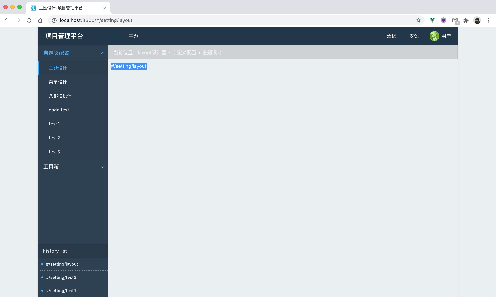

## vue hooks

将react hooks稍微改变一下，即可将react hooks转化为 vue composition-api。

- useState --> reactive、ref
- useEffect --> onMounted、onUnmounted
- 依赖 [] --> watch、watchEffect
- useRef --> ref



### useRouter

可参考 [react useRouter](../router/useRouter.md) 使用文档。

```js
const useRouter=initState=>{
  const input=ref();
  const output=ref();
  const loading=ref();
  const changeRouter=({...})=>{
    output.value=components;
  };
  watch(()=>input.value,(currentInput,prevInput,onInvalidate)=>{
    const {childKey='children',idKey='path',browserRouter=false,routers=[],basepath='',exact=false,...rest}=currentInput;
    window.addEventListener(historyEvent,changeEvent,false);
    onInvalidate(()=>{
      window.removeEventListener(historyEvent,changeEvent,false);
      cancelLoader();
    });
  });
  watchEffect(onInvalidate=>{
    input.value=initState;
  });
  return {
    output,
    loading,
  };
};

export default useRouter;

```

#### useRouter使用

```js
const setupRouter=props=>{
  const {output,loading}=vueRouter({...configs,...props,routers:permRouter(routers(list),permission),title});
  return ()=><>
    {output.value}
    {loading.value&&<Spinner global />}
  </>;
};

const Router={
  props:{
    
  },
  setup:setupRouter,
};

```

#### Link

```js
const setupLink=(props,{attrs,slots,emit})=>{
  const {to,onClick,preventDefault,...rest}=props;
  const handleClick=e=>{
    e.preventDefault();
    emit(pushEvent,to);
  };
  return ()=><a onClick={e=>handleClick(e)} href={to?.path??to??''} {...rest}>{slots.default()}</a>;
};

const Link={
  props:{
    to:{},
    preventDefault:false,
    stopPropagation:false,
    onClick:()=>{},
    rest:{},
  },
  setup:setupLink,
};

export default Link;

```


### use

可参考 [react use](../use/use) 使用文档。

### useRaf

```js
const useRaf=(initState={})=>{
  const frame=ref(0);
  const state=ref(initState);
  const setRaf=value=>{
    cancelAnimationFrame(frame.value);
    frame.value=requestAnimationFrame(()=>state.value=value);
  };
  onUnmounted(()=>{
    cancelAnimationFrame(frame.value);
  });
  return [state,setRaf];
};

```

### useScroll

```js
const useScroll=(element=null)=>{
  const listener=isElement(element)?element:window;
  const [state,setState]=useRaf(getOffset(element));
  const handler=()=>setState(getOffset(element));
  onMounted(()=>{
    listener.addEventListener('scroll',handler,{capture:false,passive:true});
  });
  onUnmounted(()=>{
    listener.removeEventListener('scroll',handler);
  });
  return state;
};

```

### useWinResize

```js
const useWinResize=()=>{
  const [state,setState]=useRaf(getViewportSize());
  const handler=()=>setState(getViewportSize());
  onMounted(()=>{
    window.addEventListener('resize',handler,false);
  });
  onUnmounted(()=>{
    window.removeEventListener('resize',handler,false);
  });
  return state;
};

```

### useClickAway

```js
const useClickAway=(elRef,handleEvent,events='click')=>{
  const handler=event=>{
    const el=elRef?.value??elRef;
    if(el?.contains&&!el.contains(event.target)){
      handleEvent(event);
    }
  };
  onMounted(()=>{
    document.addEventListener(events,handler,false);
  });
  onUnmounted(()=>{
    document.removeEventListener(events,handler,false);
  });
};

```


